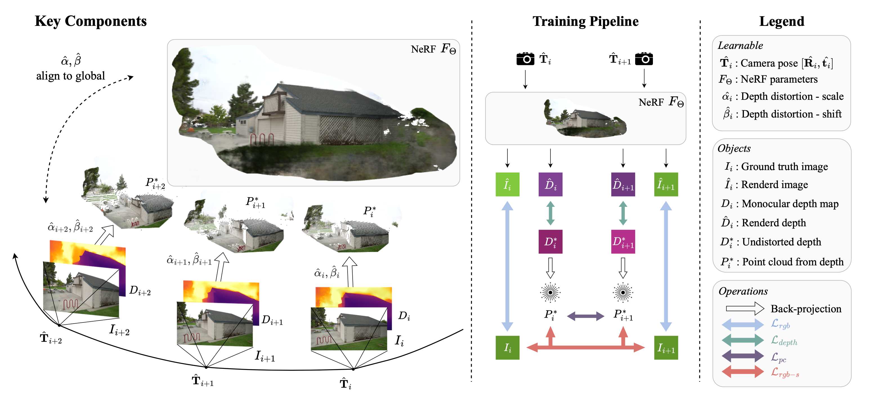

# **MNLP 2024 Project: Large Language Model Development**

## Project Overview

This project involves the development and optimization of Large Language Models (LLMs) for real-world applications, focusing on methods like Direct Preference Optimization (DPO), Retrieval-Augmented Generation (RAG), and model quantization. Our models are designed to enhance human interaction, integrate external knowledge, and deliver efficient, scalable performance.

### **Final Models** (Hosted on Hugging Face):
- **PeterAM4/EPFL-TA-Meister**: Final model trained with Supervised Fine-Tuning (SFT) and Direct Preference Optimization (DPO).
- **PeterAM4/EPFL-TA-Meister-SFT**: Model trained with Supervised Fine-Tuning (SFT) only.
- **PeterAM4/EPFL-TA-Meister-GPTQ-4bit**: Quantized model using GPTQ, optimized for 4-bit deployment.
- **PeterAM4/EPFL-TA-Meister-4bit**: Quantized model using bits and bytes for 4-bit efficiency.
- **PeterAM4/EPFL-TA-Meister-8bit**: Quantized model using bits and bytes for 8-bit efficiency.
- **PeterAM4/EPFL-TA-Meister-AWQ-4bit**: Quantized model using AWQ (4-bit) for optimal performance.

## Key Features
- **Direct Preference Optimization (DPO)**: Aligns the LLM’s responses with human preferences to improve interaction quality.
- **Multiple-Choice Question Answering (MCQA)**: Supports structured decision-making by adapting the model for MCQA tasks.
- **Retrieval-Augmented Generation (RAG)**: Enhances reasoning by integrating external document retrieval, enabling the model to access and utilize external knowledge sources.
- **Model Quantization**: Reduces the model size with 4-bit and 8-bit quantization techniques for efficient deployment without compromising performance.

## Training Pipeline



## Deliverables
- **DPO Model**: Full implementation of the Direct Preference Optimization model for human preference alignment.
- **MCQA Pipeline**: A training pipeline that extends the model’s capabilities for handling multiple-choice question answering.
- **RAG Integration**: Implementation of Retrieval-Augmented Generation to improve the model’s reasoning through document retrieval.
- **Model Quantization**: Delivery of optimized versions of the models with 4-bit and 8-bit quantization for more efficient real-world deployment.

## Codebase Structure

```txt
.
├── _templates
│   └── CS-552 Final Report Template.zip
├── _tests
│   ├── model_files_validator.py
│   ├── model_rag_validator.py
│   └── pdf_report_validator.py
├── pdfs
│   └── 4-pack-M3.pdf
├── model
│   ├── data [data for evaluation]
│       ├── sft_stackexchange_43043.json
│   │   └── sft_train_m1.json
│   ├── datasets
│   │   └── All datasets used for evaluation in jsonl files
│   ├── documents [FOR RAG ONLY]
│   │   └── STEM Books as PDF files
│   ├── evaluate [scripts for dataset evaluation]
│   │       ├── mmlu.py
│   │       ├── process_mmlu_complete.py
│   │       ├── process_mmlu_subset.py
│   │       └── process_mmlu.py
│   ├── finalization
│   │       ├── merge.py : script to merge LoRA weights
│   │       ├── push.py : script to pushe the final model to hugging face
│   ├── models
│   │       ├── model_base.py
│   │       ├── model_dpo_utils.py
│   │       └── model_dpo.py
│   ├── quantization [scripts we used to quantize]
│   │       ├── data_processing.py
│   │       ├── quantization_AWQ.py
│   │       ├── quantization_bitsandbytes_4bit.py
│   │       ├── quantization_bitsandbytes_8bit.py
│   │       └── data_processing.py
│   ├── training 
│   │       ├── dpo_train.py
│   │       ├── sft_train.py
│   ├── utils.py
│   ├── evaluator.py
│   ├── main_config.yaml
│   ├── populate_database.py
│   ├── README.md
│   ├── requirements.txt
└── README.md
```
